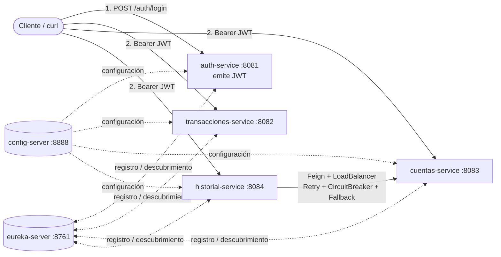

# Banco XYZ — Microservicios resilientes y seguros con Spring Cloud

**Asignatura:** Desarrollo Backend III (PBY2203) · **Semana 6:** *Implementando microservicios y seguridad en la nube con Spring Cloud*


## 1. Objetivo del proyecto

Exponer, mediante una **arquitectura de microservicios en la nube**, el resultado de la migración de los datos legacy del Banco XYZ
(repositorio [`KariVillagran/bank_legacy_data`](https://github.com/KariVillagran/bank_legacy_data)). El proyecto:

1. Centraliza la configuración en un **Config Server**.
2. Registra y descubre los microservicios con **Eureka (Service Discovery)**.
3. Implementa microservicios con **tolerancia a fallos** (Resilience4j: Retry, Circuit Breaker, Rate Limiter y Fallback).
4. Protege toda la infraestructura con **autenticación JWT y autorización por roles** (Spring Security).

## 2. Arquitectura



| Módulo | Puerto | Responsabilidad |
|---|---|---|
| `config-server` | 8888 | Configuración centralizada (repositorio nativo `config-repo/`), protegido con HTTP Basic |
| `eureka-server` | 8761 | Service Discovery, protegido con HTTP Basic |
| `auth-service` | 8081 | Login y emisión de JWT (HS256) con roles; RateLimiter anti fuerza bruta |
| `transacciones-service` | 8082 | API de `transacciones.csv` migradas |
| `cuentas-service` | 8083 | API de cuentas (`intereses.csv`) + cálculo de intereses (tasas desde Config Server) |
| `historial-service` | 8084 | API de `cuentas_anuales.csv` + integración con `cuentas-service` vía Feign |

## 3. Estructura del código

```
banco-xyz-microservicios/
├── pom.xml                       # POM padre (Spring Boot 3.3.5 + Spring Cloud 2023.0.3)
├── config-server/                # @EnableConfigServer
│   └── src/main/resources/config-repo/   # application.yml (compartido) + <servicio>.yml
├── eureka-server/                # @EnableEurekaServer
├── auth-service/                 # AuthController, TokenService, SecurityConfig
├── transacciones-service/        # domain/ migracion/ service/ web/ resilience/ config/
├── cuentas-service/              # idem + InteresService y TasasProperties
├── historial-service/            # idem + client/ (Feign) y TitularGateway


```

Cada servicio de datos sigue la misma organización: `domain` (entidad JPA + repositorio), `migracion` (lectura y limpieza del CSV),
`service` (lógica y tolerancia a fallos), `web` (controladores REST), `config` (seguridad) y `resilience` (simulador de fallas).

## 4. Requisitos

* JDK **17** o superior
* Maven **3.9** o superior
* `curl` (en Windows, usar *Git Bash*)

## 5. Cómo ejecutar


```bash
config-server       		   mvn spring-boot:run     # 1º
eureka-server       		   mvn spring-boot:run     # 2º
auth-service               	   mvn spring-boot:run
transacciones-service  	   mvn spring-boot:run
cuentas-service      		   mvn spring-boot:run
historial-service    		   mvn spring-boot:run
```

Verificación rápida: abrir <http://localhost:8761> (usuario `eureka`, clave `eureka123`) y comprobar que aparecen los 4 microservicios.

### Credenciales de demostración

| Recurso | Usuario | Clave | Rol |
|---|---|---|---|
| API (vía JWT) | `admin` | `admin123` | ADMIN |
| API (vía JWT) | `analista` | `analista123` | ANALISTA |
| Config Server | `config` | `config123` | — |
| Eureka | `eureka` | `eureka123` | — |

## 6. Uso de la API

```bash
# 1) Obtener token
TOKEN=$(curl -s -X POST localhost:8081/auth/login -H "Content-Type: application/json" \
        -d '{"username":"admin","password":"admin123"}' | sed -E 's/.*"accessToken":"([^"]+)".*/\1/')

# 2) Consumir cualquier API
curl -H "Authorization: Bearer $TOKEN" localhost:8082/api/transacciones/resumen
```

| Método y ruta | Rol mínimo | Descripción |
|---|---|---|
| `POST :8081/auth/login` | público | Devuelve JWT |
| `GET :8081/auth/me` | autenticado | Identidad contenida en el token |
| `GET :8082/api/transacciones[?tipo=]` · `/{id}` · `/resumen` · `/migracion` | ANALISTA | Transacciones migradas |
| `GET :8083/api/cuentas[?tipo=]` · `/{id}` · `/{id}/intereses` · `/resumen` · `/migracion` | ANALISTA | Cuentas e intereses |
| `GET :8084/api/historial[?transaccion=]` · `/{id}` · `/cuenta/{cuentaId}` · `/migracion` | ANALISTA | Historial anual |
| `POST :808x/api/.../migracion/reprocesar` | **ADMIN** | Re-ejecuta la migración |
| `POST :808x/api/admin/falla?activa=true` (8082 y 8083) | **ADMIN** | Simula fallas para demostrar el Circuit Breaker |
| `GET :808x/actuator/circuitbreakers` | **ADMIN** | Estado de los Circuit Breakers |

## 7. Migración de datos

Al iniciar, cada microservicio lee su CSV (dataset configurable con `banco.migracion.semana` en el Config Server:
`semana_1`, `semana_2` o `semana_3`; por defecto **`semana_3`**), aplica reglas de calidad y carga los datos válidos en una base H2.
El resultado (leídos / migrados / rechazados y motivos) queda disponible en `/api/.../migracion`.

Resultado esperado con `semana_3` (1000 filas por archivo):

| Servicio | Migrados | Rechazados | Principales motivos de rechazo |
|---|---|---|---|
| transacciones | 401 | 599 | `TIPO_INVALIDO` 230, `MONTO_VACIO` 160, `MONTO_NEGATIVO_O_CERO` 154, `FECHA_INVALIDA` 55 |
| cuentas | 50 | 950 | `CUENTA_ID_REPETIDO` 254, `SALDO_VACIO` 206, `TIPO_INVALIDO` 163, `EDAD_VACIA` 144, `EDAD_FUERA_DE_RANGO` 132 |
| historial | 417 | 583 | `SIGNO_INCONSISTENTE` 523, `MONTO_VACIO` 48, `MONTO_CERO` 12 |

Las reglas exactas están documentadas en el Javadoc de cada `MigracionService` y en `docs/PROPUESTA_TECNICA.md`.
`scripts/validar_migracion.py` recalcula estos conteos de forma independiente en Python para contrastarlos.

## 8. Seguridad

* **auth-service** emite JWT firmado (HS256) con el claim `roles`; los demás servicios actúan como *Resource Server* y validan firma y expiración.
* **Autorización por rol**: `GET /api/**` → ADMIN o ANALISTA; `POST /api/**` y `/actuator/**` → solo ADMIN. Sin token → 401; rol insuficiente → 403.
* El JWT se **propaga entre microservicios** (interceptor Feign), por lo que `cuentas-service` autentica al usuario original.
* Config Server y Eureka exigen HTTP Basic. El secreto JWT se distribuye desde el Config Server.
* ⚠️ Las credenciales y el secreto están en claro **solo por ser un proyecto académico**; en producción usar `{cipher}`, Vault o variables de entorno.

## 9. Tolerancia a fallos

| Microservicio | Patrones | Cómo se demuestra |
|---|---|---|
| transacciones-service | Retry + CircuitBreaker + RateLimiter + Fallback (`/resumen`) | `POST /api/admin/falla?activa=true` |
| cuentas-service | Retry + CircuitBreaker + RateLimiter + Fallback (`/resumen`) | `POST /api/admin/falla?activa=true` |
| historial-service | Retry + CircuitBreaker + Fallback en la llamada real a `cuentas-service` | Detener `cuentas-service` |
| auth-service | RateLimiter en `/auth/login` (10 intentos/min) | Repetir logins |

Parámetros (ventana, umbral, tiempo en estado abierto, reintentos) en `config-server/src/main/resources/config-repo/*.yml`.

